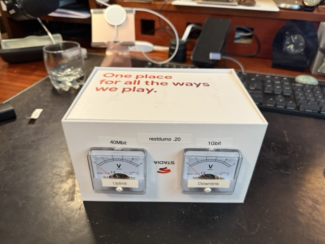
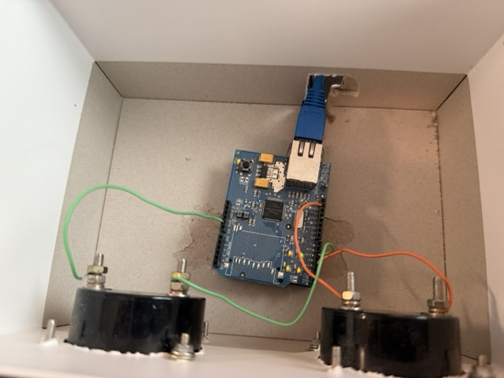

# Steampunk network monitor

## What is it?

I like having the ability to see how much Internet I'm using. On my network, I have an SNMP-enabled EdgeRouter4. To that, I ransacked the parts bin and assembled:

1. Arduino Duemanilove
2. Arduino Ethernet shield
3. Two analog gauges, 5VDC full scale

So now, when I'm pulling LLMs or ISOs or OS updates, I get the fun of seeing a old-school needle dance about. It's extra and I love it.

## How does it work?

The gauges are driven directly by the Arduino via the [RESTduino](https://github.com/jjg/RESTduino) library. In particular

    curl http://restduino.local/D3/128

(but in Python.) That drives digital pin 3 to a value of 128/255 or half scale which is half-max on the analog gauge connected
to pin 3 and ground.

To get and scale the network readings, I vibe-coded using ChatGPT 4.5, and had it generate the no-fun SNMP and interface scaling bits. A few prompt iterations was all
that it took.

## RESTDuino issues

1. I removed the extra library for Rendezvous, so you can't use 'restduino.local'. Its maybe 5 lines if you want to add that back.
2. I went fixed-IP plus DNS entry so I can use 'restduino'
3. There are issues with the Ethernet shield not resetting correctly, the sleep call was supposed to help but I have to press reset after powering on. Not sure how to fix that one.

## Python code

Basically, 

1. Read the SNMP values
2. Scale them to the known maximums
3. Print to screen and set on the gauges using Requests

